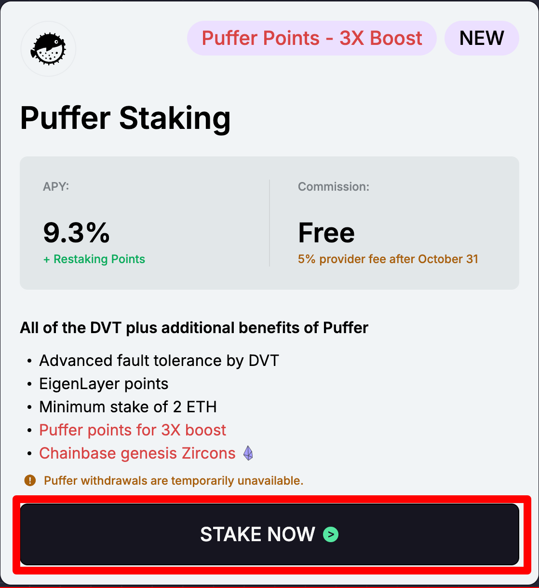

# 🐟 Puffer Staking

Ethereum staking traditionally requires a substantial commitment of 32 ETH to run a validator node. However, Chainbase, leveraging the innovative Puffer liquid restaking protocol, offers a more accessible and potentially more profitable option. With as little as 2 ETH, you can participate in Ethereum staking and take advantage of the high returns typically reserved for those with much larger stakes.

### **What is Puffer Staking?**

Puffer Staking is an Ethereum-native liquid restaking protocol that significantly lowers the entry barrier for participating in Ethereum’s Proof of Stake (PoS) consensus. By integrating with EigenLayer, Puffer Staking allows users to stake with just 2 ETH, using a combination of liquid staking tokens and Validator Tickets (VT) to maximize their earnings.

### Exploring the Ethereum Validator on the Puffer Liquid Restaking Protocol

While traditional staking requires a hefty 32 ETH per validator, the Puffer liquid restaking protocol introduces a more accessible and potentially more profitable alternative. By staking just 2 ETH, along with acquiring **Validator Tickets (VT)**, you can operate an Ethereum validator and benefit from all the rewards it generates.

#### **What are Validator Tickets (VT)?**

**Validator Tickets (VT)** are ERC20 tokens that grant the holder the right to rent a staker-funded Ethereum validator for one day. Each VT covers a single day, during which you will receive all rewards generated by the validator, including both consensus and execution rewards. This system provides a flexible and liquid way to manage staking rights, allowing you to maximize your returns with minimal initial investment.

#### Key Features of Puffer Staking with Chainbase

1. **Simplified Staking Process**: Puffer Staking with Chainbase streamlines the entire staking process, making it easy for anyone to participate. From setting up your validator to managing your rewards, the platform ensures a smooth and user-friendly experience.
2. **Significantly Enhanced Returns:** Achieve the full rewards of a 32 ETH validator by investing just 2 ETH plus the cost of Validator Tickets (VT). This approach allows you to capture all the benefits of a full validator while leveraging additional earnings from Puffer and EigenLayer Points. The system substantially boosts your staking rewards, providing a higher return on your ETH investments.
3. **High Availability with DVT (SSV)**: Chainbase leverages Distributed Validator Technology (DVT) powered by SSV to ensure the high availability and reliability of your validator nodes. This technology distributes your staking operations across multiple nodes, reducing the risk of downtime and ensuring consistent performance.
4. **Increased MEV Relay Earnings**: Our platform supports all MEV relays, allowing you to capture additional revenue opportunities. This integration enhances your overall staking profitability by tapping into these extra income streams.
5. **Low Provider Fees**: Enjoy cost-effective staking with some of the lowest provider fees in the market. Chainbase Staking ensures you keep more of your rewards while still benefiting from top-tier staking services.
6. **3X Boost Puffer Points**: By staking with Chainbase, you can earn three times the points for holding pufETH. This significant boost in points enhances your rewards, making your staking experience even more valuable and rewarding.
7. **VT Monitoring and Alerts**: With Chainbase Staking, you can rest assured that your Validator Ticket (VT) balance is always under close watch. Our platform continuously monitors your VT balance and promptly notifies you if it drops to critical levels. This proactive approach helps prevent your validator from exiting the network due to insufficient VT, ensuring uninterrupted operation and maximizing your staking rewards.

**How to Get Started with Chainbase Puffer Staking**

1. **Connect Your Wallet**: Visit the Chainbase Staking platform at [https://staking-app.chainbase.com/](https://staking-app.chainbase.com/) and connect your wallet.
2. **Prepare Your ETH**: Ensure you have at least 2 ETH or an equivalent amount of pufETH ready for staking.
3.  **Select Puffer Staking**: Navigate to the Puffer Staking section and click on **"STAKE NOW"**.

    <figure><figcaption>
Chainbase Staking > Puffer Staking
</figcaption></figure>
4.  **Follow the Setup Process**:

    * Initially, make sure you have sufficient pufETH.
    * Proceed to purchase the required Validator Tickets (VT).
    * Complete the staking process by confirming the transaction in your wallet.

    <figure><figcaption>
Chainbase Staking > Puffer Staking Steps
</figcaption></figure>
5. **Monitor Your Staking**: Use the Dashboard to track the status of your validator node and review your earnings.
6. **Receive Notifications**: We recommend using the Chainbase Staking Bot to receive all relevant notifications about your node, ensuring you stay informed about any important updates.
7. **Manage VT Balance**: Keep an eye on your Validator Tickets (VT) balance. If your VT balance falls below the required level, please replenish it promptly to avoid any disruptions in staking.

**Recommendations for  Puffer Staking**

Puffer Staking offers a reliable and potentially high-yield staking solution. However, it's important to be aware of the following considerations to make informed decisions:

* **Yield Variability**: Due to the inherent randomness in Ethereum Validator block production, there may be instances where a small number of nodes, especially in the short term, earn rewards below the average, possibly not covering the cost of Puffer VT, resulting in a loss. Achieving returns closer to the average typically requires a larger number of nodes and a longer staking period.
* **Withdrawal Limitations**: Currently, Puffer does not support withdrawals of consensus layer rewards. This limitation exists until Puffer and EigenLayer optimize the EigenPod to address the high gas fees associated with redeeming rewards. According to the Puffer roadmap, withdrawals are expected to be enabled in early Q4.
* **pufETH Liquidity**: As of now, pufETH cannot be withdrawn directly and can only be converted back to ETH through decentralized finance (DeFi) swaps. However, Puffer's roadmap indicates that direct withdrawals of pufETH will be available starting in early Q4.
* **Monthly VT Requirements**: On average, approximately 0.07291 VT per validator needs to be replenished each month to ensure the continuous operation of your validator node. Please ensure that your funds can sustain the purchase of VT until the end of Q4 when Puffer plans to enable reward withdrawals.
